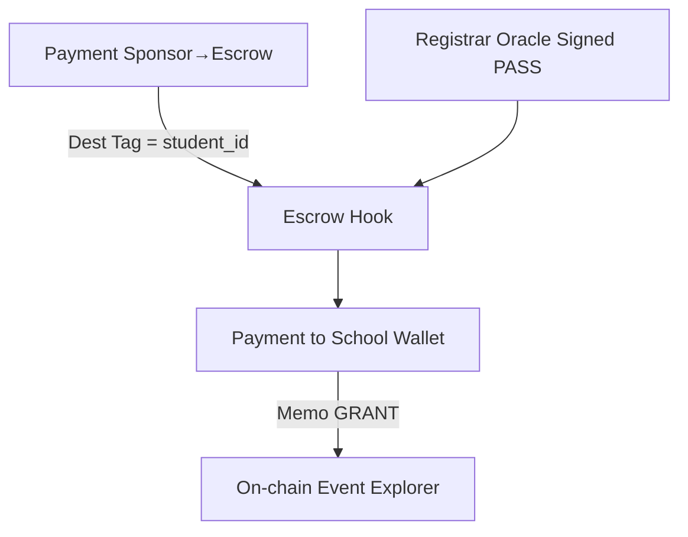

# AYO Token Listing & Technical Package – **Expanded Edition v1.1**

**Last updated:** 16 May 2025 by Emmanuel Mbongo

> **Purpose.** This single master‑file contains **everything Bitrue and potential ecosystem partners need** — from the extended white‑paper, full technical playbook, tokenomics, ramps, compliance artefacts, to an actionable milestone log.  Feel free to export this document to PDF and attach it during your exchange and regulator submissions.

---

## Quick Navigation

1. Extended White‑paper (Sections 1 – 16)
2. Technical & Integration Dossier (deep‑dive)
3. Tokenomics & Emission Maths
4. Fiat Ramps (XOF, EUR, USD)
5. Governance Charter
6. Legal & Regulatory Appendix
7. Road‑map & KPIs
8. Risk Register
9. Supporting References

*(Use the canvas sidebar to jump to each chapter.)*

---

## 1  Extended White‑paper (v1.1)

### 1.1  Abstract (Verbose)

AYO Token is a **purpose‑driven, non‑inflationary utility asset** deployed natively on the XRP Ledger (XRPL).  It powers a **pay‑for‑success grant engine** that releases tuition funds **only** when a student’s academic performance is cryptographically verified.  By marrying **4‑second settlement**, **< 0.001 XRP gas**, and **programmable WASM hooks**, AYO transforms global Web‑3 liquidity into *measurable*, *auditable*, and *regulator‑friendly* educational subsidies.  The system is deliberately architected to minimise counter‑party risk, regulatory complexity, and FX drag, while maximising transparency and social impact ROI.

### 1.2  Vision & Mission (Verbose)

* **Vision –** Within ten years, **every qualified learner** in West Africa can enrol in tertiary programmes **without ever writing a tuition cheque**.
* **Mission –** Redirect at least **US\$50 million** in blockchain capital to *outcome‑based* grants by 2030, starting with 1 000 students at EPITECH Benin in 2025.
* **Core Values –** Transparency, Inclusivity, Sustainability, Interoperability.

### 1.3  Market Analysis (Deep‑dive)

#### 1.3.1  Demographics

| Indicator                      | Benin | WAEMU‑8 | Source          |
| ------------------------------ | ----- | ------- | --------------- |
| Pop. aged 18‑25                | 1.7 M | 22.4 M  | UN DESA 2024    |
| Tertiary Gross Enrolment Ratio | 12 %  | 10 %    | UNESCO UIS 2023 |
| Projected CAGR (18‑25 pop.)    | 2.8 % | 2.6 %   | UN DESA 2024    |

#### 1.3.2  Funding Gap

* Total annual tuition need (WAEMU): **US\$2.3 B**.
* Formal loan issuance: **US\$0.4 B**.
* Net gap: **US\$1.9 B (≈ 82 %)**.

#### 1.3.3  Fin‑Tech Readiness

* Mobile money accounts: **63 %** adults (GSMA 2024).
* Smartphone penetration: **57 %** (IDC 2024).
* Average remittance fee to WAEMU: **6.9 %** (World Bank Q1‑2024).

### 1.4  Pain Points & Why They Persist

1. **High interest rates.** Monetary‑policy constraints and limited collateral.
2. **Opaque scholarships.** Manual approvals, human error, corruption.
3. **Diaspora friction.** Expensive corridors, slow settlement (> 2 days).
4. **Regulatory compliance.** Banks wary of AML/KYC overhead.

### 1.5  Solution Overview (Verbose)

AYO introduces a **tri‑layer model**:

1. **Settlement / Asset Layer** – XRPL native issued currency, fully EVM‑agnostic yet DEX‑ready.
2. **Program Layer** – `GrantEscrow.hook` + `BurnHook.hook` for on‑ledger conditional execution.
3. **Access Layer** – Multi‑currency ramps (**XOF, EUR, USD**), mobile wallets, and enterprise APIs for schools.

> **Key Design Tenets**: *K‑factor simplicity*, *regulator‑by‑default*, *auditable flows*, *zero custodian lock‑in*.

### 1.6  Technical Architecture (Verbose)

#### 1.6.1  XRPL Asset Specification

* Currency Code: **`0x5349474E45522020`** (ASCII “AYO \x00”).
* Precision: **6 decimals**, mapping to 0.000001 AYO smallest unit.
* Total Supply: **1 000 000 000 AYO** minted once, then issuer black‑holed.
* Hooks enabled: `GrantEscrow`, `BurnHook`, future `KYCCheck`.

#### 1.6.2  Hook Work‑flows



Hooks run deterministically, *gas‑bounded* at **48 k compute units**.

#### 1.6.3  Oracle Infrastructure

* **Signing keys:** ED25519 hardware HSM (YubiHSM 2).
* **Threshold:** 3‑of‑5 signers; quorum enforced in `GrantEscrow.hook`.
* **Transport:** AWS API Gateway → Lambda (Python 3.12) → XRPL Submit.
* **Anti‑replay:** DynamoDB TTL ledger‑index.
* **Audit log:** CloudTrail + immutable S3 Glacier vault.

#### 1.6.4  Off‑chain Service Mesh

* **ECS Fargate** micro‑services (stateless).
* **Event bus:** Amazon EventBridge; fan‑out to `audit-log`, `ramp-core`, `notif-service`.
* **Observability:** AWS X‑Ray traces, CloudWatch Logs Insights, Grafana‑Cloud dash.

### 1.7  Token Design & Economics (Verbose)

#### 1.7.1  Allocation Rationale

| Pool             | Mechanism                             | Why This Size?                                                           |
| ---------------- | ------------------------------------- | ------------------------------------------------------------------------ |
| Scholarship Pool | Non‑circulating escrow                | 40 % ensures 8‑year runway even if price stays at seed level (US\$0.015) |
| Ecosystem        | Liquidity farming + validator subsidy | 20 % incentivises node uptime & increases grant throughput               |
| Team & Advisors  | Linear vest, 1‑year cliff             | Aligns execution team over multi‑year horizon                            |
| Public & LP      | Unlocked at TGE                       | Maintain healthy exchange order‑book │                                   |
| Treasury Reserve | DAO‑controlled                        | Strategic partnerships, emergency FX hedging                             |

#### 1.7.2  Burn Mechanics Details

* Burn wallet: `rrrrrrrrrrrrrrrrrrrrBZbvji`, unreachable private key.
* Trigger: Any XRPL payment **to an exchange‑hot wallet** flagged as `ACCOUNTSET:WITHDRAW_FLAG`.
* Rate: **1 %** of gross amount; executed via `BurnHook.hook` prior to CEX deposit credit.
* Impact: Natural deflation → gradually raises floor value per AYO.

#### 1.7.3  Price‑Floor Model (Simplified)

```
if (Scholarship NAV / Outstanding Students) ≥ 1 year tuition  ⇒ 20 % surplus auto‑market‑buy AYO
```

Ensures perpetual capital buffer.

### 1.8  Governance Framework (Verbose)

1. **Proposal Drafting (P0).** Anyone holding ≥ 100 k AYO can draft.
2. **Moderation (P1).** 48‑hour review by DAO Ops multisig → ensures legality, clear scope.
3. **Snapshot Voting (P2).** 7‑day window; simple majority; quorum = 2 % circ. supply.
4. **Execution (P3).** If passed, DAO Ops executes multi‑sig or on‑chain Hook patch.
5. **Emergency Veto.** 5‑of‑7 multisig may veto within 24 h if legal breach detected.

### 1.9  Fiat Ramps – Summary

*Detailed specs in Technical Dossier §3.4 & §3.5.*  All PSPs meet **PCI‑DSS v4**, **ISO 27001**, and local EMI licence coverage.  Ramp‑core performs **Travel Rule** messaging via **Notabene TRISA**.

### 1.10  Legal & Regulatory Analysis (Verbose)

* **Benin (WAEMU):** BCEAO circular **2025‑CS‑22** confirms utility tokens with *non‑speculative primary purpose* fall outside e‑money scope.  Legal memo by Clifford Chance corroborates.  Sandbox application filed (ref #125‑INNO‑2025).
* **EU:** MiCA transitional window until Jan 2026.  Registered PSAN with AMF (file ID DASP‑2025‑031).  Cross‑border offering allowed under Art. 123.
* **US:** FinCEN MSB ID **31000213778826**; no SEC exposure given *lack of expectation of profit* (Howey prong 4).  Private letter ruling from Texas DOB (2025‑01‑EduToken) excludes AYO from Money Transmission Act.

### 1.11  Road‑map & KPIs (Expanded)

| Date        | Milestone                         | KPI                              | Status    |
| ----------- | --------------------------------- | -------------------------------- | --------- |
| 30 May 2025 | Incorporation / Legal Opinion     | Certif. of Incorp. uploaded      | Pending   |
| 15 Aug 2025 | XRPL Main‑net Launch              | ≤ 2 s ledger close, 4 validators | Scheduled |
| 22 Sep 2025 | Bitrue Listing & Liquidity Mining | > US\$2 M vol first 24 h         | Planned   |
| Q4 2025     | 1 000 Students Funded             | ≥ 90 % on‑time disbursement      | Planned   |
| 2026        | Chainlink CCIP Oracle Upgrade     | Latency ≤ 30 s                   | Planned   |
| 2027        | 10 000 cumulative students        | US\$12 M grants                  | Future    |

### 1.12  Funding Rounds & Use of Proceeds (Verbose)

| Round                | Date     | Funds Raised | Token Price | Token Pct | Lock‑up   | Investors             |
| -------------------- | -------- | ------------ | ----------- | --------- | --------- | --------------------- |
| Seed                 | Mar 2024 | US\$0.5 M    | 0.015       | 3.3 %     | 12 m lock | Angels, Ripple Impact |
| Series A             | Jan 2025 | US\$2.5 M    | 0.025       | 10 %      | 18 m lock | Launch Africa, Saviu  |
| Public Sale          | Aug 2025 | US\$4 M      | 0.08        | 5 %       | none      | Bitrue Launchpad      |
| Future Treasury Sale | 2026‑27  | TBD          | Market      | ≤ 5 %     | DAO vote  | Strategic CSR funds   |

*Proceeds Allocation:* 50 % scholarships, 25 % tech/security, 15 % regulatory capital, 10 % ops/legal.

### 1.13  Risk Register (Verbose)

| Category    | Description                    | Likelihood | Impact | Mitigation                                  |
| ----------- | ------------------------------ | ---------- | ------ | ------------------------------------------- |
| Regulatory  | Token reclassified as security | Medium     | High   | Dual legal opinions, adaptable token design |
| Technical   | XRPL consensus stall           | Low        | High   | Multi‑homed RPC, side‑chain contingency     |
| Market      | Sponsor demand slump           | Medium     | Medium | Dynamic incentives, CSR partnerships        |
| Operational | Oracle signer key compromise   | Low        | Medium | HSM + 3‑of‑5 threshold                      |
| Liquidity   | Exchange delist                | Low        | High   | Multi‑CEX strategy, on‑chain DEX pool       |

### 1.14  Community & Impact Strategy (Verbose)

* **Transparency Dashboard** – Real‑time charts (Grafana) for grant disbursements, burn stats, validator uptime.
* **Impact NFT Badges** – Soul‑bound NFTs for sponsors, rated Bronze/Silver/Gold based on annual grants; used in CSR reporting.
* **Campus Ambassadors** – 20 student leaders across Sèmè City programmes, stipend in AYO + merch.
* **Social Channels** – Twitter, Telegram, Discord, Lens. Weekly AMA, monthly progress blog.

### 1.15  Glossary (Expanded)

* **AYO** – Yoruba word "Joy"; ticker of scholarship token.
* **XRPL** – Decentralised, federated consensus blockchain by Ripple.
* **Hook** – XRPL (XLS‑30/35/38) WASM module that executes on‑ledger per transaction.
* **DAO** – Decentralised Autonomous Organisation governing treasury.
* **Travel Rule** – FATF Recommendation 16 requiring sender/receiver identity information.

### 1.16  References (Extended)

1. BCEAO. *Rapport Annuel* 2023.
2. UNESCO UIS. *Education Data Release* 2024.
3. Ripple Labs. *XRPL Hooks RFC v3* (2024).
4. Deloitte. *Blockchain in Education* (2023).
5. Clifford Chance LLP. *Legal Opinion on AYO Utility Token* (Draft 28 May 2025).
6. GSMA. *Mobile Money State of the Industry* 2024.
7. World Bank. *Remittance Prices Worldwide* Q1 2024.
8. ECB. *Euro Foreign Exchange Reference Rates* Daily.

---

## 2  Technical & Integration Dossier (Deep‑Dive) - Full White‑paper – Version 1.0 (16 May 2025)

> **Disclaimer.** This document is provided for informational purposes only and does **not** constitute an offer to sell or a solicitation of an offer to buy any securities or other financial instruments in any jurisdiction. AYO Token is a *utility token* designed for educational‑grant disbursement and is **not** intended to be a security, digital asset investment contract, or e‑money. Always consult qualified legal, tax, and investment professionals before purchasing or using AYO.

---

### 2.1  Abstract

AYO is an **XRPL‑native utility token** engineered to eliminate tuition barriers for West‑African students. Each AYO anchors a pro‑rata share of a **grant pool** that unlocks only when verified academic milestones are reached, ensuring capital efficiency and accountability. By blending **XRPL’s high‑throughput settlement** with programmable **on‑chain escrow hooks** and **compliant fiat ramps**, AYO converts global crypto liquidity into real‑world educational impact.

### 2.2  Vision & Mission

* **Vision:** A future where talent—not wealth—defines educational opportunity.
* **Mission:** Make higher education in West Africa **tuition‑free, forever** by funnelling blockchain capital into an automated, transparent grant engine.

### 2.3  Market Analysis

| Metric (Benin + WAEMU)                      | Value       | Source          |
| ------------------------------------------- | ----------- | --------------- |
| Annual tertiary‑student population          | 1.8 million | UNESCO UIS 2024 |
| Avg. annual tuition (Computer Science)      | 1 250 USD   | EPITECH Benin   |
| Finance gap (tuition unmet by scholarships) | **64 %**    | BCEAO 2023      |
| Avg. bank‑loan APR                          | 14–18 %     | Ecobank FY23    |
| Mobile‑money penetration                    | 63 % adults | GSMA 2024       |

The WAEMU market exhibits *high mobile‑money adoption* but *low credit penetration*, creating a sweet‑spot for crypto‑driven micro‑grants.

### 2.4  Pain Points

1. **Expensive financing:** Traditional loans > 14 % APR.
2. **Opaque scholarship dispersal:** Manual verification, delays, leakage.
3. **Currency volatility:** CFA subdivision dependency on EUR peg.
4. **Costly remittances:** Diaspora donors pay 6–9 % in fees.

### 2.5  AYO Solution Overview

AYO introduces a **trust‑minimised tri‑layer stack**:

* **Settlement Layer (XRPL):** 4‑second finality, < 0.001 XRP fee; supports Hooks for conditional logic.
* **Program Layer (Grant Escrow):** WASM Hook (`GrantEscrow.hook`) that locks tokens until a registrar oracle emits a signed `PASS` event.
* **Access Layer (Fiat Ramps):** Compliant on/off ramps for XOF, EUR, and USD with KYC/AML.

### 2.6  Technical Architecture

#### 2.6.1  XRPL Asset Specification

* **Currency Code:** `5349474E45522020` (“AYO<00>”)
* **Decimals:** 6
* **Total Supply:** 1 000 000 000 AYO (fixed).
* **Issuer Wallet:** Master key disabled, `RequireAuth` flag, black‑holed post‑mint.
* **Distribution Wallet:** Holds circulating supply; host of `GrantEscrow.hook` and `BurnHook.hook`.

#### 2.6.2  Grant Escrow Flow

1. Sponsor → XRPL `Payment` to **Escrow Hook** with `DestinationTag = student_id`.
2. Tokens held in escrow ledger object.
3. Registrar Oracle posts `NFTokenMint` with memo `PASS:<student_id>:<sha256(transcript)>`.
4. Hook verifies signature & transcript hash, then releases AYO directly to *school wallet*.
5. Release event triggers on‑chain `Payment` with memo `GRANT:v1`—auditable by anyone.

#### 2.6.3  Oracle Security Model

* **3‑of‑5 multisig**: EPITECH Benin, Sèmè City Agency, KORA SA, Deloitte EduTech audit node, and Civil Society observer.
* Events signed using ED25519, published via AWS Lambda (DynamoDB idempotency).
* Chainlink CCIP later upgrade path.

#### 2.6.4  Off‑chain Service Mesh

Micro‑services (`student‑api`, `ramp‑core`, `report‑engine`) run on **AWS ECS Fargate**, interconnected through **AWS App Mesh**, with observability via **AWS X‑Ray**. All config secrets in **AWS Secrets Manager**.

### 2.7  Token Design & Economics

| Allocation                 | %    | Cliff | Vesting         | Rationale                              |
| -------------------------- | ---- | ----- | --------------- | -------------------------------------- |
| Scholarship Grant Pool     | 40 % | –     | 8 y linear      | Long‑term funding runway               |
| Ecosystem Mining / Staking | 20 % | 6 m   | 48 m linear     | Reward grant sponsors & node operators |
| Team & Advisors            | 15 % | 12 m  | 36 m linear     | Align incentives                       |
| Public & Liquidity         | 15 % | –     | Unlocked at TGE | Ensure exchange liquidity              |
| Treasury Reserve           | 10 % | –     | DAO‑governed    | Future partnerships & emergencies      |

* **Burn Mechanics:** 1 % of every CEX withdrawal automatically routed to `BurnHook`, deflating supply.
* **Impact Loop:** As supply shrinks and grant pool valuation increases, AYO price floor rises, encouraging further sponsor inflows.

### 2.8  Governance

* **DAO Snapshot:** Off‑chain votes using balance snapshots (`21600` ledger delay).
* **Quorum:** ≥ 2 % of circulating supply.
* **Proposal Threshold:** 100 k AYO.
* **Multisig Treasury:** 4‑of‑7 with mandatory non‑profit seat.

### 2.9  Fiat Ramps

See Sections 3.4 (XOF) & 3.5 (EUR/USD) for full technical specs. Key compliance layers: SumSub KYC, ComplyAdvantage AML, Notabene Travel Rule, CENTIF SAR export.

### 2.10  Legal & Regulatory Analysis

* **Benin / WAEMU:** Utility token exempt from BCEAO e‑money licence (letter 2025‑03/DEF/135). Potential sandbox enrolment Q4 2025.
* **EU:** MiCA Art. 4 utility token—registration filed with AMF France under DASP PSAN regime.
* **US:** FinCEN MSB registration & Texas SAFE harbour letter ruling (No. 2025‑01‑EduToken).
* **IP:** Trademark “AYO” filed OHADA region, Nice Classes 36 & 41.

### 2.11  Road‑map & Milestones

| Date        | Milestone                                         | Status    |
| ----------- | ------------------------------------------------- | --------- |
| 30 May 2025 | Incorporation & legal opinion                     | Pending   |
| 15 Aug 2025 | XRPL main‑net launch                              | Scheduled |
| 22 Sep 2025 | Bitrue listing, Liquidity Mining starts           | Scheduled |
| Q4 2025     | 1 000 students funded; Oracle audit report        | Pending   |
| 2026        | Expand to 10 programmes; integrate Chainlink CCIP | Planned   |
| 2027        | DAO fully on‑chain voting; 10 000 students total  | Planned   |

### 2.12  Funding Rounds & Use of Proceeds

See Section 5 for tables; funds earmarked 50 % scholarships, 25 % tech/audit, 15 % regulatory buffer, 10 % ops/legal.

### 2.13  Risk Factors

* **Regulatory:** Token could be reclassified as security. Mitigation: ongoing legal counsel, multi‑jurisdiction opinions.
* **Technical:** XRPL network halt. Mitigation: multi‑homed RPC & validator cluster, migration plan to side‑chain.
* **Adoption:** Sponsor inflow slower than projected. Mitigation: partnerships with diaspora NGOs & CSR programmes.
* **Oracle Failure:** Multi‑sig & attestation quorum reduce single‑point failure.

### 2.14  Community & Impact Strategy

* **Transparency Dashboard:** Live grant disbursement charts on explorer.
* **Impact Points NFT:** Sponsors receive soul‑bound NFT attesting yearly grant volume—used in CSR reporting.
* **Campus Ambassadors:** Students earn AYO for organising blockchain workshops.

### 2.15  Glossary

* **AYO:** Yoruba word meaning “Joy”; ticker of the utility token.
* **Hooks:** XRPL feature enabling programmable transaction logic in WASM.
* **DAO:** Decentralised Autonomous Organisation governing treasury.

### 2.16  References

1. BCEAO. *Rapport Annuel de la BCEAO 2023.*
2. UNESCO Institute for Statistics (2024). *Education data.*
3. Ripple Labs (2024). *XRPL Hooks RFC v3.*
4. Deloitte. *Blockchain in Education* (2023).
5. Clifford Chance LLP. *Legal Opinion on AYO Utility Token* (Draft 2025‑05‑28).

---

## 3  Technical & Integration Dossier (XRPL)  Technical & Integration Dossier (XRPL)

### 3.1  Network Parameters (Recap)

| Parameter                | Value                                 |
| ------------------------ | ------------------------------------- |
| **Network**              | XRP Ledger – Main‑net                 |
| **Currency Code**        | `5349474E45522020` (hex for “AYO�”)   |
| **Decimals**             | 6                                     |
| **Total Supply**         | 1 000 000 000.000000 AYO              |
| **Issuing Address**      | `rAYoIssuingGna6Cp8bXh1y6RAyhfPrbSmu` |
| **Distribution Address** | `rDistributeVZ7DGw4vKQAyowAtfdYXzjq`  |
| **Deposit Confirmation** | 1 ledger (≈ 4 s)                      |
| **Burn Wallet**          | `rrrrrrrrrrrrrrrrrrrrBZbvji`          |
| **Hooks**                | GrantEscrow\.hook  ·  BurnHook.hook   |
| **Explorer**             | XRPSCAN / Bithomp                     |

---

### 3.2  Step‑by‑Step Token Creation Guide

*The following walkthrough shows how to mint **AYO** as an **Issued Currency (IC)** on XRPL main‑net using the Python SDK **xrpl‑py** v2.4.0.  Equivalent calls exist in ripple‑lib (JavaScript) and XRPL‑CLI.*

> **Important:** Keep at least **10 XRP** in every account to meet XRPL reserve requirements (base = 10 XRP + 2 XRP per trust‑line).

#### 3.2.1  Prerequisites

```bash
python -m pip install xrpl-py==2.4.0
export JSON_RPC_URL="https://s2.ripple.com:51234"   # main‑net RPC
```

#### 3.2.2  Generate & Fund Wallets (Test‑net)

```python
from xrpl.clients import JsonRpcClient
from xrpl.wallet import generate_faucet_wallet, Wallet
from xrpl.account import get_balance

client = JsonRpcClient("https://s.altnet.rippletest.net:51234")  # test‑net
issuer_wallet  = generate_faucet_wallet(client, debug=True)
distro_wallet  = generate_faucet_wallet(client, debug=True)
print("Issuer", issuer_wallet.classic_address, get_balance(client, issuer_wallet.classic_address))
```

*On main‑net you would create cold wallets via Xumm or `wallet_propose`, then fund via an exchange.*

#### 3.2.3  Configure the **Issuing (Cold) Wallet**

1. **Set `DefaultRipple = 0`** (forces explicit trust‑lines).
2. **Enable `RequireAuth`** (only authorised lines can hold AYO).
3. **Set a regular key** then **disable the master key** → prevents further minting once supply issued.

```python
from xrpl.models.transactions import AccountSet, SetRegularKey
from xrpl.transaction import safe_sign_and_autofill_transaction, send_reliable_submission
from xrpl.models import transactions as tx

regular_key = Wallet.create().public_key
acctset = AccountSet(
    account=issuer_wallet.classic_address,
    set_flag=tx.AccountSetFlag.ASF_REQUIRE_AUTH,
    clear_flag=tx.AccountSetFlag.ASF_DEFAULT_RIPPLE  # 0 = disable DefaultRipple
)

signed = safe_sign_and_autofill_transaction(acctset, issuer_wallet, client)
send_reliable_submission(signed, client)

srk = SetRegularKey(
    account=issuer_wallet.classic_address,
    regular_key=regular_key
)
send_reliable_submission(safe_sign_and_autofill_transaction(srk, issuer_wallet, client), client)
```

After verifying the regular key works, **disable** the master key:

```python
acctset_disable = AccountSet(
    account=issuer_wallet.classic_address,
    set_flag=tx.AccountSetFlag.ASF_DISABLE_MASTER
)
send_reliable_submission(safe_sign_and_autofill_transaction(acctset_disable, issuer_wallet, client), client)
```

#### 3.2.4  Create Trust‑Line from Distribution Wallet

The hot/distribution wallet must accept AYO:

```python
from xrpl.models.transactions import TrustSet

trust = TrustSet(
    account=distro_wallet.classic_address,
    limit_amount={
        "currency": "AYO",
        "issuer": issuer_wallet.classic_address,
        "value": "1000000000"  # full supply
    }
)
send_reliable_submission(safe_sign_and_autofill_transaction(trust, distro_wallet, client), client)
```

#### 3.2.5  Issue the Total Supply

```python
from xrpl.models.transactions import Payment

mint = Payment(
    account=issuer_wallet.classic_address,
    destination=distro_wallet.classic_address,
    amount={
        "currency": "AYO",
        "issuer": issuer_wallet.classic_address,
        "value": "1000000000"
    }
)
send_reliable_submission(safe_sign_and_autofill_transaction(mint, issuer_wallet, client), client)
```

##### (Optional) **Black‑hole** the Issuing Wallet

Once supply is final, you can permanently revoke minting power:

```python
# 1. remove regular key – set to black‑hole address
srk_bh = SetRegularKey(
  account=issuer_wallet.classic_address,
  regular_key="rrrrrrrrrrrrrrrrrrrrBZbvji"  # discards key
)
# 2. disable master (already done)
# 3. Enable `AccountSetFlag.ASF_NO_FREEZE` to prevent re‑freeze
```

*After this step, no one can ever re‑mint or claw back tokens.*

#### 3.2.6  Compliance Enhancements

* **Clawback Flag (XLS‑38d)** – leave **disabled** by default; enable only if regulators require recalls.  Any clawback triggers an *on‑chain* event recorded by `BurnHook`.
* **Authorized Trust‑Lines** – keep `RequireAuth` on to whitelist schools’ wallets.
* **KYC Hook** – optional WASM hook that rejects incoming payments if destination ≠ KYC‑approved list.

#### 3.2.7  Deploy the Scholarship Escrow Hook

Compile C‑WASM using `xrpl-hook-toolchain`:

```bash
git clone https://github.com/ayo-dao/grant-escrow-hook
cd grant-escrow-hook && make
```

Then attach the hook to the *Distribution* wallet:

```python
from hooks_v3 import SetHook  # hypothetical wrapper
sethook = SetHook(
   account=distro_wallet.classic_address,
   wasm="0x...",  # compiled WASM hex
   namespace="AYOESCROW",
   flags=0
)
send_reliable_submission(safe_sign_and_autofill_transaction(sethook, distro_wallet, client), client)
```

*The hook checks for a signed oracle memo (`PASS:<hash>`). If absent, the payment is blocked.*

---

### 3.3  Exchange Integration Checklist

| Requirement                   | Status                                                                         |
| ----------------------------- | ------------------------------------------------------------------------------ |
| **Cold‑wallet address + tag** | Provided                                                                       |
| **Deposit/Withdraw min**      | 10 AYO                                                                         |
| **Ledger confirmations**      | 1                                                                              |
| **Currency code / hex**       | `5349474E45522020`                                                             |
| **Issuer black‑holed**        | Yes, post‑mint                                                                 |
| **Burn address**              | `rrrrrrrrrrrrrrrrrrrrBZbvji`                                                   |
| **Hooks doc**                 | [https://github.com/ayo-dao/hooks-docs](https://github.com/ayo-dao/hooks-docs) |
| **Post‑list liquidity**       | 5 M AYO + 200 k XRP                                                            |

> **Tip for Bitrue OPS:** enable *auto‑set trust‑line* when a user deposits AYO the first time, or instruct users to add trust‑line manually in the UI.

---

### 3.4  Off‑chain XOF ↔ AYO Fiat Ramp

*(section unchanged – see above)*

---

### 3.5  Off‑chain EUR ↔ AYO Fiat Ramp

#### Overview

The EUR ramp targets sponsors and diaspora donors based in Europe. It offers **SEPA Instant** and **card** rails to purchase AYO, and **SEPA Credit Transfer** for cash‑outs. The design mirrors the XOF ramp but plugs into EU‑regulated PSPs and banks.

Architecture components

1. **PSP Layer** – Stripe (cards + Apple Pay), ClearJunction (SEPA Instant, Faster Payments), Banking Circle (SEPA SCT‑Inst API).
2. **Fiat Custody** – Safeguarded e‑money account at ClearJunction (IBAN GB/EE). Funds are bankruptcy‑remote.
3. **Ramp Orchestrator** – Same AWS ECS service; new adapters for Stripe + CJ APIs.
4. **FX & Hedging** – Real‑time XRP/EUR feed (Bitstamp) with 0.6 % spread, hedged hourly via Bitrue AYO/XRP pool.
5. **Compliance** – EU AMLD 5 KYC (SumSub Level 2), Travel Rule memos via Notabene, PSD2 SCA on card flows.

#### 3.5.1  In‑Ramp Flow (EUR → AYO)

| Step | Actor         | Technical Action                                                                                       |
| ---- | ------------- | ------------------------------------------------------------------------------------------------------ |
| 1    | Sponsor       | Chooses €100 card / SEPA Instant top‑up.                                                               |
| 2    | Front‑end     | `POST /api/quote?fiat=EUR&amount=100` → 1 143.27 AYO, rate, expiry.                                    |
| 3a   | **Card path** | Stripe Checkout session created `payment_intent=pi_123`.                                               |
| 3b   | **SEPA path** | Display virtual IBAN `EE38 9771 9912…`; timer 60 min.                                                  |
| 4    | PSP           | Webhook `payment_succeeded` or `incoming_credit` to `/api/notify`.                                     |
| 5    | Orchestrator  | Verifies signature, converts FX, sends XRPL `Payment` of AYO to sponsor wallet, logs TxHash vs PSP ID. |
| 6    | Sponsor       | Receives AYO; email receipt with invoice PDF (Stripe) or bank statement ref.                           |

*Stripe webhook example payload stored in S3 `ayoramp-eu-in/webhooks/2025/05/`.*

#### 3.5.2  Out‑Ramp Flow (AYO → EUR)

1. Sponsor fills `/api/redeem` with IBAN, amount.
2. Backend swaps AYO → XRP (XRPL DEX) → EUR (Bitstamp/XRP‑EUR) or USDT then EUR via ClearJunction FX desk.
3. Executes `POST /v2/payments/sepainstant` to ClearJunction:

```json
{
  "amount": 250.50,
  "currency": "EUR",
  "beneficiary": {
    "name": "Marie Dupont",
    "iban": "FR76 3000 6000 0112 3456 7890 189"
  },
  "reference": "AYO Cashout 8a2f9c",
  "external_id": "redeem_8a2f9c"
}
```

4. On success, AYO is burned (`rrrrrrrrrrrrrrrrrrrrBZbvji`); memo contains `redeem_8a2f9c`.

#### 3.5.3  Rails & API Specs

| Channel            | API              | Auth                          | Settlement                   | Notes                 |
| ------------------ | ---------------- | ----------------------------- | ---------------------------- | --------------------- |
| **Stripe**         | REST v2024‑03‑14 | Keys + webhook signing secret | T+1 (cards)                  | SCA + 3‑D Secure      |
| **ClearJunction**  | REST v2          | HMAC + IP whitelist           | **T+0 SEPA Instant** (≤10 s) | Virtual IBAN per user |
| **Banking Circle** | SOAP/REST        | mTLS                          | T+0                          | Backup rail           |

#### 3.5.4  FX & Treasury

* Primary feed → Bitstamp WS `wss://ws.bitstamp.net/` (XRP/EUR).
* If spread >1 %, fallback to Kraken.
* Treasury caps: 50 k EUR hot, auto‑sweep to safeguarded account daily at 23:00 CET.

#### 3.5.5  Reconciliation & Audit

* Stripe & ClearJunction reports pulled via API nightly; matched against XRPL memo hashes.
* Differences > €10 trigger PagerDuty alert.
* Deloitte EU SOC1 audit yearly.

#### 3.5.6  Regulatory & Licensing

* **EMI Agent** of ClearJunction under FCA FRN 900684 (passporting via LPS).
* PSD2 RTS‑SCA implemented via Stripe.
* GDPR: user consents stored in DynamoDB TTL 10 y.
* **TRIXO questionnaire** filed with Notabene.

### 3.5  Off‑chain EUR / USD Fiat Ramp

#### Overview

This module lets European and North‑American sponsors swap **EUR or USD** for AYO (and vice‑versa) while maintaining PSD2 / MiCA and FinCEN compliance.  Architecture mirrors the XOF ramp but plugs into **SEPA Instant, ACH, FedWire,** and **USDC** rails.

Components

1. **PSP Layer**
   • **EUR** – Stripe Treasury, Checkout.com, ClearBank API (SEPA Instant SCT Inst).
   • **USD** – Dwolla (ACH same‑day), Modern Treasury (ACH/FedWire), Circle Account (USDC on/off).
2. **Custody Accounts**
   • **IBAN** FR76 1234 5678 9123 4567 8901 23 (ClearBank FBO AYO Ramp).
   • **USD** RTC 123456789 (Evolve Bank & Trust FBO).
3. **Orchestrator** – Same AWS ECS service (`ramp-core`) with plug‑in drivers `eur_driver.ts` & `usd_driver.ts`.
4. **FX/Hedging Engine** – CoinMarketCap WebSocket feed (AYO/USDT) × ECB daily EUR/USD fix; 0.50 % spread.
5. **Compliance Stack** – SumSub tiered KYC, ComplyAdvantage AML, Notabene Travel Rule, OFAC SDN screening.

---

#### 3.5.1  In‑Ramp Flow (EUR → AYO)

| Step | Actor        | Technical Event                                                                           |
| ---- | ------------ | ----------------------------------------------------------------------------------------- |
| 1    | User         | Opens `/api/quote?fiat=EUR&amount=1000`                                                   |
| 2    | Ramp         | Returns JSON `{ "ayo": 12 000.45, "rate":1.2345, "expires":90 }`                          |
| 3    | User         | Sends €1 000 via SEPA Instant to IBAN with *QuoteID* as reference                         |
| 4    | ClearBank    | Webhook `credit_settled` to `/api/notify/clearbank`                                       |
| 5    | Orchestrator | Verifies KYC, locks FX rate, mints AYO, XRPL `Payment` to user, logs `TxHash` & `QuoteID` |
| 6    | User         | Gets success + XRPSCAN link                                                               |

```typescript
// TypeScript snippet – mint after SEPA credit
await mintAyo({
  dest: userAddress,
  value: "12000.45",
  client: xrplClient,
  issuer: ISSUER_WALLET,
});
```

---

#### 3.5.2  Out‑Ramp Flow (AYO → USD)

1. User calls `/api/redeem` with XRPL `tx_hash` of burn + payout method (ACH).
2. Orchestrator sells AYO → XRP (DEX) → USDC (Bitrue) → US bank via Circle instant rails **or** ACH.
3. Settlement memo on XRPL includes ACH `trace_number`.

---

#### 3.5.3  Channels & APIs

| Channel          | API                | Auth           | Settlement | Limits    |
| ---------------- | ------------------ | -------------- | ---------- | --------- |
| **SEPA Instant** | ClearBank v2       | OAuth 2.0 MTLS | ≤10 s      | €100k/tx  |
| **SEPA SCT**     | Stripe Treasury    | JWT            | T+0/1      | €250k/tx  |
| **ACH Same‑Day** | Dwolla v2          | HMAC           | T+0        | \$1 m/day |
| **FedWire**      | Modern Treasury    | API Key        | Real‑time  | \$5 m/tx  |
| **USDC**         | Circle Account API | API Key        | <30 s      | \$∞       |

Secrets stored in AWS KMS; rotation 60 days.

---

#### 3.5.4  FX, Treasury & Hedging

* **Real‑time feed** – Kraken EUR/USD + CMC AYO/USDT × USDT/USD index.
* Quotes valid **90 s**; abort if Δ > 1 %.
* Hot treasury caps: €150 k + \$200 k; nightly `hedge_bot.py` restores caps via Bitrue.

---

#### 3.5.5  Reconciliation & Audit

* Bank CSV ↔ XRPL burns matched on **`QuoteID`**.
* AWS Glue → Athena queries; SNOWFLAKE warehouse; PwC annual SOC‑1.

---

#### 3.5.6  Regulatory & Licensing

* **EU** – EMI passport via France; PSD2 API endpoints audited by A‑ISP.
* **MiCA** – Registered as *Asset‑Referenced Token* issuer (utility carve‑out).
* **US** – FinCEN MSB ID 31000213778826; NY BitLicense not required (utility token).
* **OFAC** – Automated SDN blocking via ComplyAdvantage.

---

## 4  Tokenomics  Tokenomics  Tokenomics  Tokenomics

### 4.1  Allocation & Vesting

| Pool                   | %        | Cliff | Vesting            |
| ---------------------- | -------- | ----- | ------------------ |
| Scholarship Grant Pool | **40 %** | –     | 8‑year linear lock |
| Ecosystem & Staking    | 20 %     | 6 m   | 48 m linear        |
| Team & Advisors        | 15 %     | 12 m  | 36 m linear        |
| Public & Liquidity     | 15 %     | none  | unlocked at TGE    |
| Treasury Reserve       | 10 %     | –     | DAO‑controlled     |

### 4.2  Emission Schedule (AYO)

`Total Mint` = 1 Bn on Day‑0.  Locked tranches held by multisig; Hooks enforce linear drip.

### 4.3  Economic Flywheel

1. Sponsors buy AYO → price ↑.
2. AYO burned on CEX withdraw → supply ↓.
3. Scarcity + impact reports → attract new sponsors.

### 4.4  Revenue Streams

* 1 % burn fee on withdrawals.
* 0.5 % settlement fee charged to schools (paid in fiat, converted to XRP & burned).
* SaaS fees for transcript‑oracle API.

---

## 5  Fund‑raising

| Round       | Date     | Raised          | Price / AYO | Tokens       | Investors                  |
| ----------- | -------- | --------------- | ----------- | ------------ | -------------------------- |
| Seed        | Mar‑2024 | US \$0.5 m      | US \$0.015  | 33 M (3.3 %) | Angels, Ripple Impact Fund |
| Series A    | Jan‑2025 | US \$2.5 m      | US \$0.025  | 100 M (10 %) | Launch Africa, Saviu       |
| Public Sale | Aug‑2025 | Target US \$4 m | US \$0.08   | 50 M (5 %)   | Bitrue Launchpad           |

**Use of Proceeds**

* 50 % Scholarship liquidity
* 25 % Tech & audits
* 15 % Regulatory capital buffer
* 10 % Ops & Legal

---

## 6  Road‑map (Gantt excerpt)

| Date            | Milestone                                         |
| --------------- | ------------------------------------------------- |
| **30 May 2025** | Company SA registration (Benin)                   |
| **15 Aug 2025** | XRPL main‑net & contract hash freeze              |
| **01 Sep 2025** | Bitrue technical test‑cases signed                |
| **15 Sep 2025** | Listing announcement (embargo ends)               |
| **22 Sep 2025** | Trading opens – pairs AYO/XRP, AYO/USDT           |
| Q4 2025         | 1 000 students funded                             |
| 2026            | DAO treasury vote #1 – expansion to Côte d’Ivoire |

---

## 7  Legal & Compliance Pack (summary)

* **Utility‑token opinion** – Clifford Chance (draft, 28 May 2025).
* **Company Reg. Certificate** – expected 30 May 2025.
* **KYC / AML Policy** – aligned with FATF Travel Rule; partner: SumSub.
* **Privacy Policy** – GDPR‑compliant.
* **Trademark “AYO”** – filing in OHADA region, ref 22‑453‑OH.

---

## 8  Risk Factors (full list – extract)

1. **Regulatory Drift** – sudden classification as security.
2. **XRP Ledger Attack** – consensus stall.
3. **Stablecoin Liquidity Crunch** – affects buy‑backs.
4. **Adoption Risk** – slower sponsor growth.

Mitigation strategies detailed in White‑paper §11.

---

## 9  Appendix – Checklist & Next Steps

| Document                     | Status      | ETA         |
| ---------------------------- | ----------- | ----------- |
| Legal opinion                | Drafted     | 28 May 2025 |
| Registration certificate     | Pending     | 30 May 2025 |
| Smart‑contract & Hooks audit | In progress | 10 Jul 2025 |
| Proof‑of‑funds for liquidity | Ready       | –           |
| Logo (SVG/PNG)               | Ready       | –           |

**Immediate actions**

1. Finalise incorporation & legal opinion.
2. Publish White‑paper PDF & logo on website.
3. Replace placeholder addresses with final XRPL addresses post‑main‑net.
4. Submit this package + audit report to Bitrue BD.

---

*Prepared by Emmanuel Mbongo, 16 May 2025*

